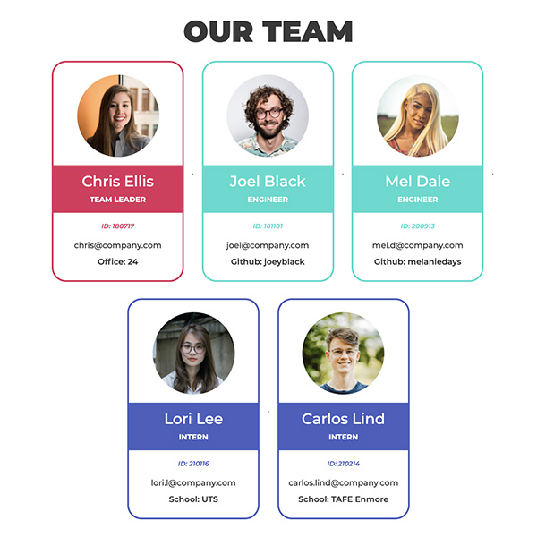

# Team Profile Generator

This command line application prompts you to enter your team's information, then generates a HTML file populated with the info that you can later use in your website.

[See a walkthrough video of the application](https://www.youtube.com/watch?v=_4yxSopk-xQ)

## Table of contents
  - [Motivation](#motivation)
  - [Built with](#built-with)
  - [Features](#features)
  - [Installation](#installation)
  - [Tests](#tests)
  - [How to Use](#how-to-use)
  - [Credits](#credits)

## Motivation
This application aims to provide an easy and super quick way to generate a HTML team page, with a simple command line application to input the information into. 

## Built With
- Javascript
- HTML
- CSS
- [Node.js](https://nodejs.org/en/)
- [npm Inquirer](https://www.npmjs.com/package/inquirer)
- [npm Jest](https://www.npmjs.com/package/jest)
- [Bootstrap](https://getbootstrap.com/)
- [Adobe XD](https://www.adobe.com/au/products/xd.html) (output file prototyping)

## Features
The application starts by asking the user to input the Team Leader's information, then gives the option to add more team members by Employee or Intern. Once all the team members have been added, a nicely formatted HTML file is generated in the folder populated with the information input by the user.

### [See walkthrough video.](https://www.youtube.com/watch?v=_4yxSopk-xQ)

## Installation
Download the package, navigate to the folder from your terminal and run the `npm install` command to install the required dependencies.

## Tests
From your terminal, navigate to the application's folder and run the `npm test` command. This will use [Jest](https://www.npmjs.com/package/jest) to run the tests.

## How to use
From your terminal, navigate to the application's folder and run `node index.js`. The application will prompt you for your Team Leader's information, then you will have the option to add team members as Engineers or Interns. Once you've finished adding your team members, choose `I am done adding team members` from the options menu and a HTML file called `team.html` will be generated in your folder populated with the information you have entered into the application.

## Credits
All photos used in the demo are from [Unsplash](https://unsplash.com/).